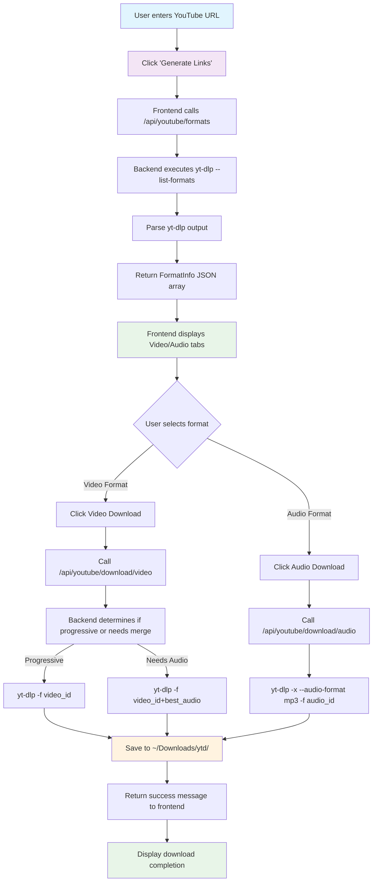
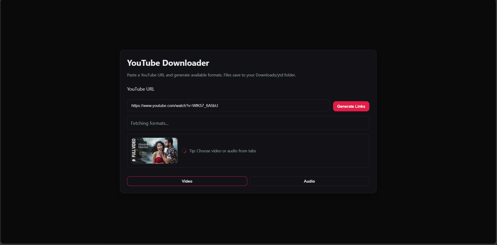
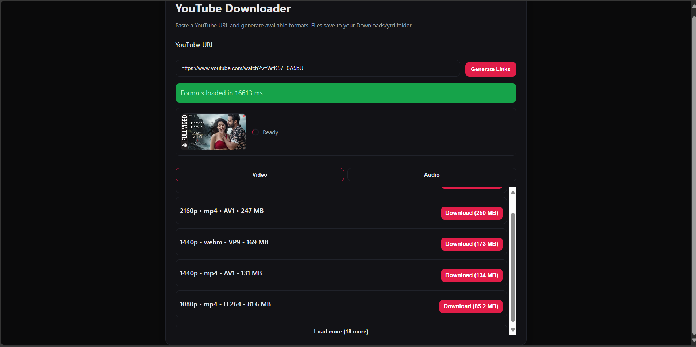
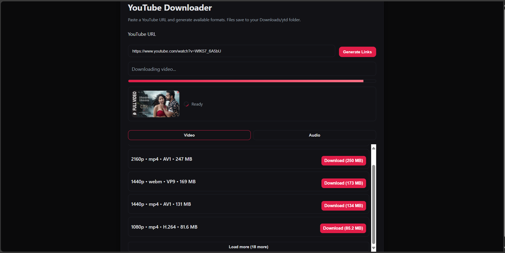
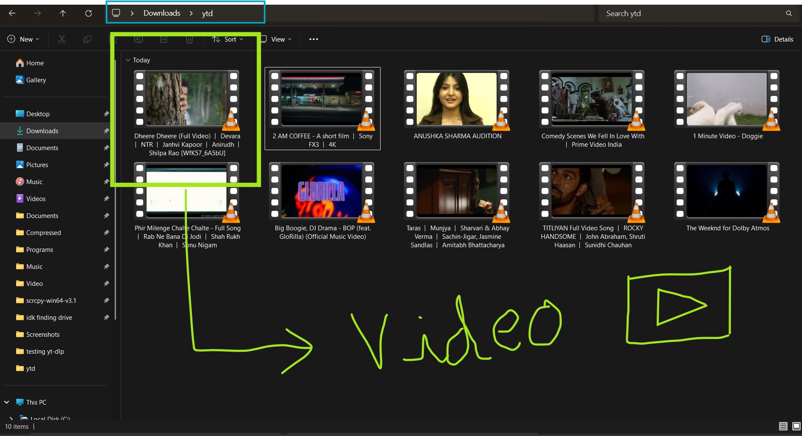

# YouTube Downloader

A sleek, modern YouTube downloader built with **Spring Boot** and **yt-dlp**. Clean UI, fast downloads, and supports both video and audio formats!

## Features

- **Video Downloads** - Download any YouTube video in multiple qualities
- **Audio Extraction** - Extract audio as MP3 with best quality
- **Thumbnail Preview** - See video thumbnails before downloading
- **Responsive UI** - Clean, dark-themed interface that works everywhere
- **Fast Processing** - Powered by yt-dlp for reliable downloads
- **Organized Storage** - All downloads saved to `~/Downloads/ytd/`

## API Flow Diagram

Here's how the application works under the hood:



## Screenshots

### URL Input Interface


### Generate Links Interface


### Choose Download Format


### Downloaded Video


## Tech Stack

- **Backend**: Spring Boot 3.5.4 + Java 17
- **Frontend**: Vanilla HTML/CSS/JavaScript
- **Download Engine**: yt-dlp CLI
- **Build Tool**: Maven
- **UI Theme**: Custom dark theme with modern design

## Quick Start

### Prerequisites

Make sure you have these installed:
- **Java 17** or higher
- **Maven** (or use the included wrapper)
- **yt-dlp** - [Installation Guide](https://github.com/yt-dlp/yt-dlp#installation)
- **ffmpeg** - [Download here](https://ffmpeg.org/download.html)

### Installation

1. **Clone the repository**
   ```bash
   git clone https://github.com/yourusername/Youtube-Dowloader.git
   cd Youtube-Dowloader
   ```

2. **Run the application**
   ```bash
   ./mvnw spring-boot:run
   ```
   
   Or on Windows:
   ```cmd
   mvnw.cmd spring-boot:run
   ```

3. **Open your browser**
   ```
   http://localhost:8080
   ```

That's it! 

## How to Use

1. **Paste YouTube URL** - Copy any YouTube video URL
2. **Generate Links** - Click the button to fetch available formats
3. **Choose Format** - Switch between Video/Audio tabs
4. **Download** - Click download on your preferred format
5. **Find Files** - Check your `Downloads/ytd/` folder

## API Endpoints

The backend exposes these REST endpoints:

- `GET /api/youtube/formats?url={youtube_url}` - List available formats
- `GET /api/youtube/download/video?url={url}&videoFormatId={id}` - Download video
- `GET /api/youtube/download/audio?url={url}&audioFormatId={id}` - Download audio

## UI Features

- **Dark Theme** - Easy on the eyes
- **Tab Interface** - Separate video and audio formats
- **Thumbnail Preview** - See what you're downloading
- **Progress Indicators** - Visual feedback during processing
- **Responsive Design** - Works on desktop and mobile

## Project Structure

```
src/
├── main/
│   ├── java/com/suguru/geto/yt_downloader/
│   │   ├── YoutubeDowloaderApplication.java    # Main Spring Boot app
│   │   ├── controller/
│   │   │   └── YoutubeDownloadController.java  # REST API endpoints
│   │   ├── service/
│   │   │   └── YoutubeDownloadService.java     # Core download logic
│   │   └── model/
│   │       └── FormatInfo.java                 # Format data model
│   └── resources/
│       ├── static/
│       │   ├── index.html                      # Main UI
│       │   ├── styles.css                      # Dark theme CSS
│       │   └── script.js                       # Frontend logic
│       └── application.properties              # App config
└── test/
    └── java/                                   # Test files
```

## Configuration

The app uses these default settings:
- **Server Port**: 8080
- **Download Directory**: `~/Downloads/ytd/`
- **Output Format**: `%(title)s.%(ext)s`

## Troubleshooting

**yt-dlp not found?**
- Make sure yt-dlp is installed and in your PATH
- Try: `yt-dlp --version`

**ffmpeg errors?**
- Install ffmpeg and add to PATH
- Required for audio extraction and format conversion

**Downloads not working?**
- Check if the YouTube URL is valid
- Some videos may be region-restricted
- Try updating yt-dlp: `yt-dlp -U`

## Contributing

Feel free to open issues or submit PRs! This project was built for learning and I'm always open to improvements.

## License

This project is open source and available under the [MIT License](LICENSE).

## Acknowledgments

- [yt-dlp](https://github.com/yt-dlp/yt-dlp) - Amazing YouTube download tool
- [Spring Boot](https://spring.io/projects/spring-boot) - Fantastic Java framework
- [ffmpeg](https://ffmpeg.org/) - Multimedia processing powerhouse

---

**Made with by a passionate developer who loves clean code and good UX!**

*If you find this useful, give it a on GitHub!*
