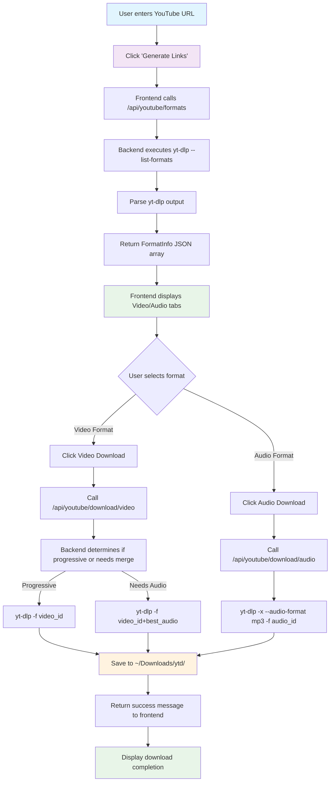

```mermaid
graph TD
    A[User enters YouTube URL] --> B[Click 'Generate Links']
    B --> C[Frontend calls /api/youtube/formats]
    C --> D[Backend executes yt-dlp --list-formats]
    D --> E[Parse yt-dlp output]
    E --> F[Return FormatInfo JSON array]
    F --> G[Frontend displays Video/Audio tabs]
    G --> H{User selects format}
    
    H -->|Video Format| I[Click Video Download]
    H -->|Audio Format| J[Click Audio Download]
    
    I --> K[Call /api/youtube/download/video]
    J --> L[Call /api/youtube/download/audio]
    
    K --> M[Backend determines if progressive or needs merge]
    M -->|Progressive| N[yt-dlp -f video_id]
    M -->|Needs Audio| O[yt-dlp -f video_id+best_audio]
    
    L --> P[yt-dlp -x --audio-format mp3 -f audio_id]
    
    N --> Q[Save to ~/Downloads/ytd/]
    O --> Q
    P --> Q
    
    Q --> R[Return success message to frontend]
    R --> S[Display download completion]
    
    style A fill:#e1f5fe
    style B fill:#f3e5f5
    style G fill:#e8f5e8
    style Q fill:#fff3e0
    style S fill:#e8f5e8
```
